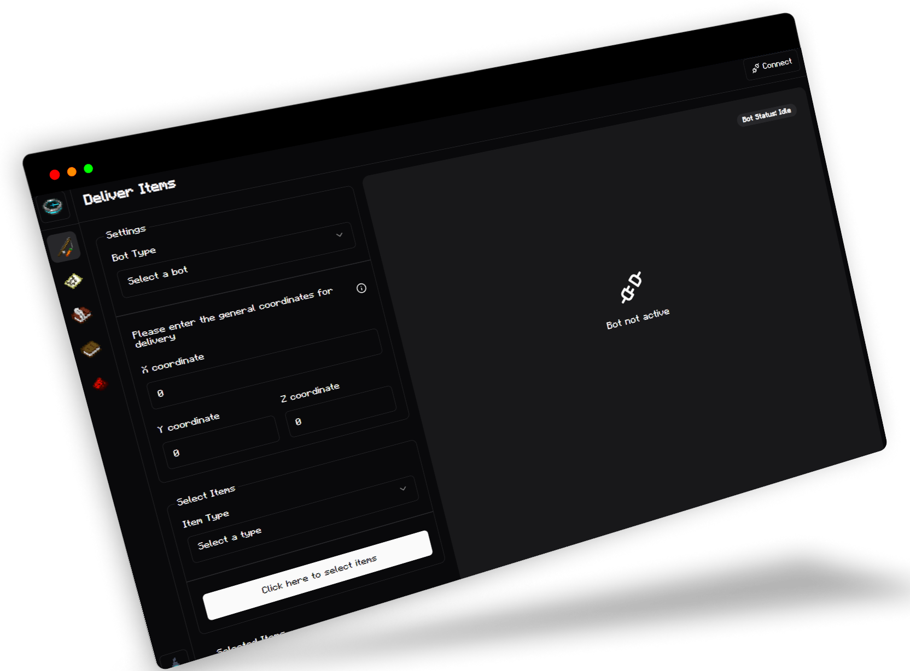
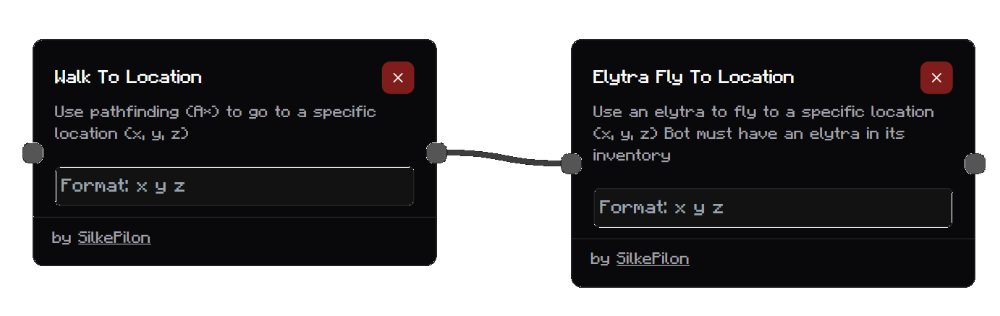
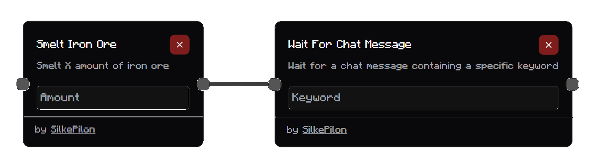

<file-attachment-contents filename="README.md">

<h1 align="center">
  <br>
  <a href="/"></a>
  <br>
</h1>

<h4 align="center">🤖 An web platform for a block game.</h4>

<p align="center">
    
      <a href="https://python.org/"></a>
  <a href="https://github.com/reworkd/AgentGPT/blob/master/docs/README.zh-HANS.md"></a>
  <a href="soon!"></a>
</p>

<p align="center">
  <a href="#about-">About</a> •
  <a href="#freature-and-plugins-">Features</a> •
  <a href="#how-to-install-">Install</a>
</p>

## About 📬

Project Skyview (idk if this is a good name?) is an open-source Minecraft bot management platform that provides players with a user-friendly web interface to create and control helpful bots. Our goal is to enhance the Minecraft multiplayer experience with powerful automation tools, all at no cost to the player.

<h1>
  <a href="/"></a>
</h1>

## Getting Started

Check our [Wiki](link-to-wiki) for detailed guides on:

- Setting up Project Skyview
- Creating and managing bots
- Using the item delivery system
- Accessing the 2D map view
- Building an custom bot using nodes
- And more!

## Roadmap

- Add checkboxes to nodes (booleans)
- Add an way in export and import flows.
- Auto save flows to browser.

## Features 🕹

| Feature name        | Description                               | Available   |
| ------------------- | ----------------------------------------- | ----------- |
| Defender            | Follows and attacks nearby players        | No          |
| Shield Aura         | Follows and protects owner                | No          |
| Schematic Builder   | Builds structures from schematics         | Planned     |
| Raid Alerts         | Sends alerts on explosions and mob spawns | No          |
| Area Miner          | Mines designated areas                    | No          |
| Chat Spy            | Views the bot's chat                      | Planned     |
| Sugar Cane Farmer   | Harvests and stores sugar cane            | Coming soon |
| Cactus Farm Builder | Builds cactus farms                       | Yes         |
| Container Viewer    | Checks bots' inventories                  | Coming soon |
| Chat to Discord     | Forwards chat to Discord                  | Planned     |
| Wander              | Moves bots randomly                       | Planned     |
| Auto Eater          | Eats when hungry or damaged               | Planned     |
| Crop Farmer         | Farms crops                               | Planned     |
| Inventory Manager   | Manages bot inventories                   | Planned     |

## How To Install 📥

### Simple 1 liner install

Linux:
```bash
curl -sL -o main.zip https://github.com/SilkePilon/OpenDeliveryBot/archive/refs/heads/main.zip && unzip main.zip && cd OpenDeliveryBot-main && npm install && cd .. && rm main.zip && cd OpenDeliveryBot-main && node main.js


```

Windows (curl):
```bash
curl -sL -o main.zip https://github.com/SilkePilon/OpenDeliveryBot/archive/refs/heads/main.zip && tar -xf main.zip && cd OpenDeliveryBot-main && npm install && cd .. && del main.zip && cd OpenDeliveryBot-main && node main.js


```

Windows (PowerShell):
```powershell
Invoke-WebRequest -Uri "https://github.com/SilkePilon/OpenDeliveryBot/archive/refs/heads/main.zip" -OutFile "main.zip"; Expand-Archive -Path "main.zip" -DestinationPath .; cd .\OpenDeliveryBot-main; npm install; cd ..; Remove-Item -Path "main.zip"; cd .\OpenDeliveryBot-main; node main.js


```

MacOS:
```bash
curl -sL -o main.zip https://github.com/SilkePilon/OpenDeliveryBot/archive/refs/heads/main.zip && unzip main.zip && cd OpenDeliveryBot-main && npm install && cd .. && rm main.zip && cd OpenDeliveryBot-main && node main.js


```

### Manual Install
#### 1. Clone the Repository
First, make a local copy of the repository:

```bash
git clone https://github.com/SilkePilon/OpenDeliveryBot.git
```

Open the cloned repository in your preferred terminal app.

#### 1. Install packages
Assuming you have [Node](https://nodejs.org/en/download/package-manager/current) and [NPM](https://www.npmjs.com/) installed you can run the following commands:

```bash
npm install
node main.js
```

That's it! You can now open up https://open-delivery-bot.vercel.app/ and start creating!

## Adding Custom Nodes to the Project

<h1>
  <a href="/"></a>
</h1>

Welcome to the project! This guide will walk you through the steps to add custom nodes. Follow these instructions to contribute your custom functionality.

### 1. Clone the Repository

First, make a local copy of the repository:

```bash
git clone https://github.com/SilkePilon/OpenDeliveryBot.git
```

Open the cloned repository in your preferred IDE.

### 2. Create a New Node File

Navigate to the `flow_functions` folder in the project directory. Create a new file for your node with the following naming conventions:

- **Name Format:** `your_node_name.js`
- **Rules:**
  - Use lowercase letters
  - Use underscores (`_`) to separate words
  - Do not include numbers in the file name

For example, if you want to create a node for crafting planks, you might name the file `craft_planks.js`.

### 3. Update `functions.json`

In the `flow_functions` directory, open the `functions.json` file and add an entry for your new node:

```json
{
  "YOUR_NODE_NAME": {
    "name": "YOUR_NODE_NAME",
    "file": "YOUR_NODE_NAME.js",
    "id": "YOUR_NODE_NAME",
    "label": "DISPLAY NAME",
    "hasInput": true,
    "description": "YOUR NODE DESCRIPTION",
    // example of input
    "input": { "amount": "number", "message": "text" },
    "author": "YOUR NAME"
  }
}
```

**Replace the placeholders:**

- `YOUR_NODE_NAME` - The name of your node (in lowercase with underscores)
- `DISPLAY NAME` - The name displayed in the UI
- `YOUR NODE DESCRIPTION` - A description of what your node does
- `YOUR NAME` - Your GitHub username
- `{ "NAME": "number", "NAME": "text" }` - Your input fields.

### 4. Implement the Node

Open your newly created file and implement your node using the following structure:

```javascript
const { getBot } = require("../main.js");

function main(data) {
  // Get the bot object
  const bot = getBot();
  // Your function logic here
  console.log("Executing test_node with data:", data);
}

module.exports = { main };
```

**Key Points:**

- Require `bot` from `../main.js`.
- The `main` function should be defined and exported. This function is executed when the node runs.
- Use `try` and `catch` statements for error handling. If an error occurs, log it and rethrow it to ensure it can be caught elsewhere.

**Accessing input fields**
In order to the get values from the input field of a node you can use the `data` argument in the `main` function
an example:
in `functions.json` I've added an function with the following input:
`{ "Amount": "number", "Message": "text" }`
now i can access them in the `main` function by doing: `data.amount` and `data.message`
the parameter name is based on the key provided in the input.

**Examples**

You can also checkout some of the already made nodes:

- [Chat](https://github.com/SilkePilon/OpenDeliveryBot/blob/main/flow_functions/chat.js)
- [Wait for chat message](https://github.com/SilkePilon/OpenDeliveryBot/blob/main/flow_functions/wait_for_chat_message.js)
- [Walk to](https://github.com/SilkePilon/OpenDeliveryBot/blob/main/flow_functions/walk_to.js)

**Limitations**

- no way of outputting custom data from a node.

### 5. Submit a Pull Request

Once you’ve added your node and updated the `functions.json` file, push your changes to a new branch and open a pull request on GitHub.

```bash
git checkout -b your-feature-branch
git add .
git commit -m "Add custom node YOUR_NODE_NAME"
git push origin your-feature-branch
```

Go to the GitHub repository and create a pull request. Your changes will be reviewed, and if everything looks good, they will be merged!

## Thank You!

Thank you for contributing to the project! If you have any questions or need further assistance, feel free to reach out.

Happy coding! 🚀

## images:

<!-- 
 -->

## Support

If you encounter any issues or have questions, please open an issue on this GitHub repository. We're here to help!

</file-attachment-contents>
